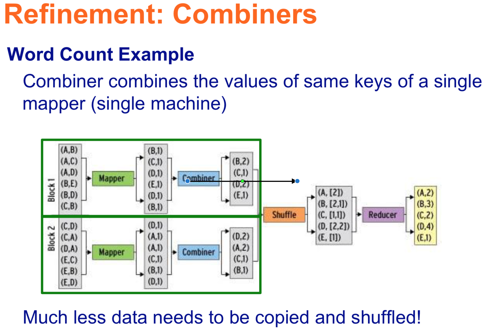

# Week 3. MapReduce and Hadoop (Continued)

## Dealing with failures
1. master node fail
    - Restart entire MapReduce job
2. compute node of a map worker fail
    - Reset completed or in-progress map tasks at worker to idle
    - Restart **all** the map tasks assigned to this node -> lose intermediate files from this node
    - Inform Reduce workers when task is rescheduled on another worker, location of input from that map task has changed
3. compute node of a reduce worker fail
    - **Only** reset in-progress tasks to idle
    - Restart these reduce tasks at another node

## Number of Map and Reduce jobs to allocate
- M map tasks, R reduce tasks
- make M > number of nodes in the cluster
    - One DFS chunk per map is common
    - Improves dynamic load balancing and speeds up recovery from worker failures
- Usually R < M
    - Because output is spread across R files

## Why Map outputs to Local Disk?
- Map output is intermediate
    - To be processed by reduce task to produce final output
    - Can be discarded after job is complete 
    - Storing in DFS with replication is overkill
- Automatically rerun map task on another node to recreate the map output if the node running map task fails before the map output is consumed by reduce task

## Refinement
1. Backup Tasks
 - Slow workers significantly lengthen job completion time
    - Other jobs on the machine 
    - Bad disks
    - Weird things
- Solution
    - Near end of phase, spawn _(refers to a function that loads and executes a new child process)_ backup copies of tasks
        - Whichever one finishes first “wins”
- Effect
    - Dramatically shortens job completion time
2. Combiners(可结合 w2_extension.md 理解)
- A Map task often produce many pairs of the form (k,v1), (k,v2), ... for the same key k
- A Combiner is a local aggregation function for repeated keys produced by the same map
    - For associative operations such as sum, count, max 
    - Decreases size of intermediate data
    - Save network use
    - Example local counting for Word Count def combiner (key, values): output (key, sum(values))

3. Partition FUnction 
- control how keys are partitioned (特殊需要，不用default)
- Reduce needs to ensure that records with the same intermediate key end up at the same worker
    - System uses a default partition function: hash(key) mod R 
    - Sometimes useful to override the hash function:
        - e.g., hash(hostname(URL)) mod R ensures URLs from a host end up in the same output file

## Algorithms using MapReduce

### Matrix-Vector Multiplication

- Matrix-vector product is a vector x of length n
xi =Σmijvj
- Matrix M and vector v stored in separate files in DFS 
- Compute nodes that are executing map task read vector v 
- Each map task operate on a chunk of matrix M
- Map function
    - Apply to one element of M
    - Produce key-value pair (i, mijvj)
    - All terms of the sum that make up component xi of the matrix-vector product will get the same key i
- Reduce function
    - Sum up all the values associated with a given key i. 
    - Result is a pair (i, xi)

### Relational Algebra Operations
- Relation Links describe Web structure
    - Two attributes From and To
    - Row or tuple is a pair of URLs such that there is at least one link from the first URL to the second
    - Billions of tuples
- Solution
    - Relation stored as a file in the DFS
    - Elements are tuples of the relation 
- Operations
    - Selection
        - apply condition C to each tuple in relation and output only those tuples that satisfy C
        - Map 
            - for each tuple t in R, test if it satisfy C
            - if yes, output (t,t)
        - Reduce 
            - Identify -> just return (t,t)
    - Projection
        - Given subset S of attributes, produce from each tuple only the values for the attributes in S
        - Map
            - for each tuple t in R, construct tuple t' by eliminating values of attributes that are not in S
            - output (t', t'
        - Reduce
            - eliminate duplicates
            - (t',[t',t',...t']) -> (t',t')
    - Union, Intersection, Difference 
    - Natural Join
        - Join R(A,B) and S(B,C)
            - find tuples that agree on the B attributes
            - use B as key, and value will be the other attributes and relation name
        - Map
            - each tuple (a,b) in R -> (b, (R, a))
            - each tuple (b,c) in R -> (b, (S, c))
        - Reduce
            - each key value b is associated with a list of pairs either (b, (R,a)) or (b, (S,c))
            - Join on b value, outputs (a,b,c)
        - Use relation links to find paths of length 2 in Web
        - triplets of url (u,v,w) such that there is a link from u to v and from v to w
    - Grouping and Aggregation
        - R(A,B,C), apply operator gammaA,theta(B)(R)
        - Map
            - grouping: (a,b,c) -> (a,b)
        - Reduce
            - each key represents a group
            - apply **aggregate operator** theta to the list of B values associated with key a 
            - Output is a pair (a,theta(b_list))
                - example of theta: max, sum etc.

### Matrix Multiplication
Product P = MN is a natural join followed by grouping and aggregation
>*p*ik = Σjmijnjk
- natural join
    - Map
        - Each matrix element mij → key-value pair (j, (M, i, mij))
        - Each matrix element njk → key-value pair (j, (N, k, njk))
    - Reduce
        - Each key j will be associated with a list of values that are either (M, i, mij) or (N, k, njk)
        - Match all the pairs (M, i, mij) and (N, k, njk) to produce a key-value pair with key (i, k) and value equals to product of mij and njk
- grouping and aggregate
    - Map
        - Identity
    - Reduce
         - sum the list of values associated with key (i, k)
         - Result is a pair ((i, k), v) where v is the value of the element in row i and column k of matrix P = MN
